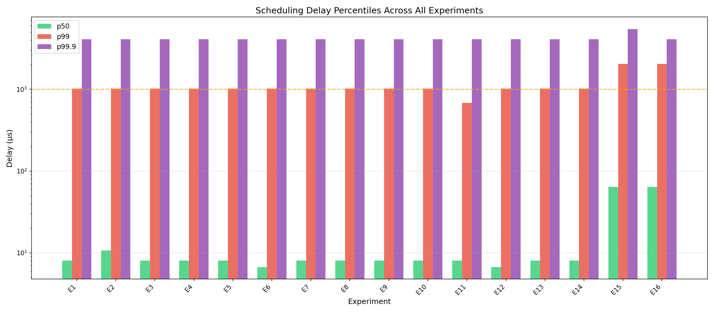
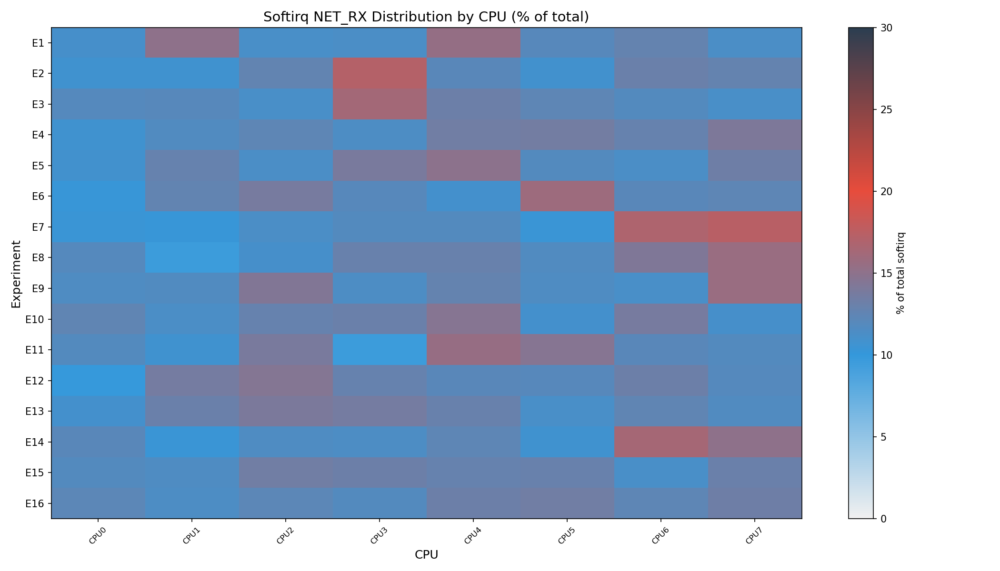
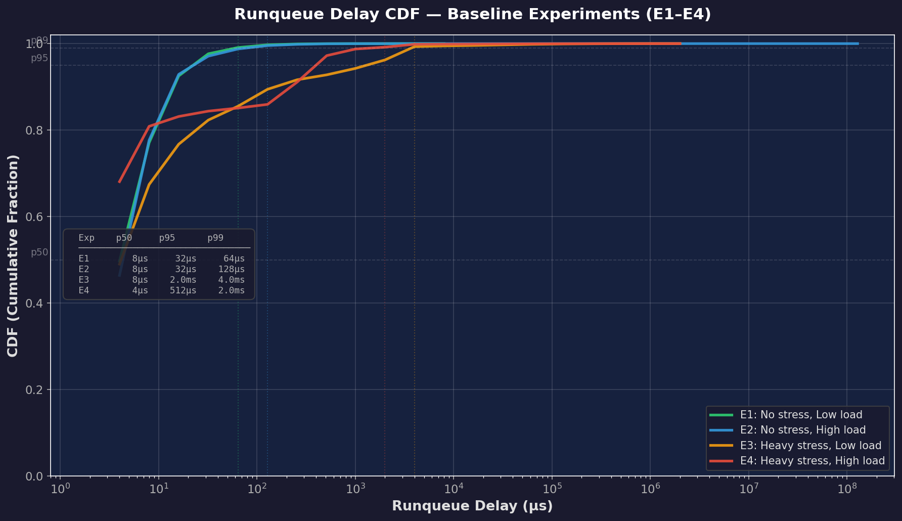
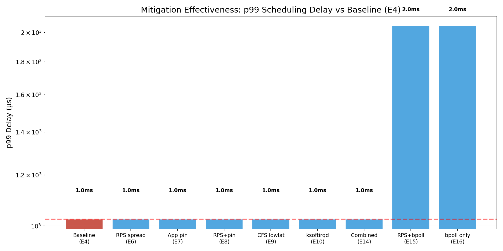

# Profiling Kernel Scheduling Delays Under Network-Intensive Workloads

> **An eBPF-Based Analysis and Mitigation Framework**

[](https://kernel.org)
[](https://github.com/bpftrace/bpftrace)
[](https://iiitd.ac.in)

On commodity Linux systems, the kernel's softirq processing path (`NET_RX_SOFTIRQ`, NAPI poll, TCP/IP stack) competes directly with user-space threads for CPU time. This project uses **eBPF** to instrument the Linux scheduler and network subsystems, quantifying these invisible scheduling delays through **16 controlled experiments** (48 total runs) on a single-machine testbed with network namespaces and veth pairs.

---

## 🔬 Key Findings

| # | Finding | Data |
|---|---------|------|
| 1 | **CPU contention is the dominant scheduling delay source** | 27× increase in p99 (149 μs → 4,096 μs) |
| 2 | **Softirq follows socket affinity on veth, not RPS** | Gini coefficient 0.66–0.78 across experiments |
| 3 | **UDP and TCP produce equivalent p99 under stress** | Both 4,096 μs — CPU contention dominates |
| 4 | **The stress cliff is non-linear** | Moderate stress: 683 μs vs Heavy: 4,096 μs |
| 5 | **No single mitigation fixes CPU starvation** | All mitigations show identical p99 = 4,096 μs |
| 6 | **Mitigation stacking is counter-productive** | Highest tail latency seen with RPS + Pin + CFS |
| 7 | **`SO_BUSY_POLL` reduces context switches by 19%** | E16: 27.3M vs E4: 33.8M context switches |

## 📊 Sample Results

<p align="center">
  
  
</p>
<p align="center">
  
  
</p>

## 🏗 Architecture

```
┌──────────────────────────────────────────────────────────────┐
│                    Host Machine (8 cores)                     │
│                                                              │
│  ┌──────────┐     veth pair      ┌──────────┐               │
│  │  srv ns   │◄─────────────────►│  cli ns   │               │
│  │ 10.0.0.1  │  (88 Gbps veth)   │ 10.0.0.2  │               │
│  │ iperf3 -s │                   │ iperf3 -c │               │
│  └──────────┘                    └──────────┘               │
│                                                              │
│  ┌────────────────── eBPF Probes ──────────────────┐        │
│  │ sched_delay.bt  │ softirq_net.bt │ proc_pollers │        │
│  │ net_drops.bt    │ cpu_migrations │              │        │
│  └─────────────────────────────────────────────────┘        │
│                                                              │
│  stress-ng --cpu N  (optional CPU contention)                │
└──────────────────────────────────────────────────────────────┘
```

## 🧪 Experiment Matrix

16 experiments × 3 runs = **48 total runs**, each 60 seconds with 2s settle time.

| Exp | CPU Stress | Net Load | RPS | App Pin | CFS | Protocol | Purpose |
|-----|-----------|----------|-----|---------|-----|----------|---------|
| E1 | None | Low | Default | — | Default | TCP | Baseline |
| E2 | None | High | Default | — | Default | TCP | Net load only |
| E3 | Heavy | Low | Default | — | Default | TCP | CPU stress only |
| E4 | Heavy | High | Default | — | Default | TCP | **Worst case** |
| E5 | Heavy | High | CPU 0 | — | Default | TCP | RPS pinned |
| E6 | Heavy | High | All | — | Default | TCP | RPS spread |
| E7 | Heavy | High | Default | 2,3 | Default | TCP | App pinned |
| E8 | Heavy | High | CPU 0 | 2,3 | Default | TCP | RPS + pin |
| E9 | Heavy | High | Default | — | Lowlat | TCP | CFS tuning |
| E10 | Heavy | High | Default | — | Default | TCP | ksoftirqd |
| E11 | None | High | Default | — | Default | UDP | UDP baseline |
| E12 | Heavy | High | Default | — | Default | UDP | UDP + stress |
| E13 | Moderate | High | Default | — | Default | TCP | Threshold |
| E14 | Heavy | High | All | 2,3 | Lowlat | TCP | Combined |
| E15 | Heavy | High | All | — | Default | TCP | RPS + busy poll |
| E16 | Heavy | High | Default | — | Default | TCP | Busy poll only |

## 📁 Repository Structure

```
├── scripts/                         # Experiment orchestration
│   ├── 24_setup_testbed.sh            # Create/teardown network namespaces + veth
│   ├── 24_run_experiment.sh           # Run a single experiment (10 CLI params)
│   └── 24_run_all_experiments.sh      # Run all 16 experiments × 3 runs
│
├── ebpf_tools/                      # eBPF instrumentation (5 scripts)
│   ├── 24_sched_delay.bt              # sched_wakeup → sched_switch runqueue delay
│   ├── 24_softirq_net.bt              # NET_RX/TX softirq per-CPU duration
│   ├── 24_net_drops.bt                # kfree_skb drops + tcp_retransmit_skb
│   ├── 24_cpu_migrations.bt           # sched_migrate_task tracking
│   ├── 24_proc_pollers.sh             # /proc/stat, softnet_stat, snmp, sockstat
│   └── 24_busy_poll_echo_server.c     # Custom SO_BUSY_POLL echo server (E15/E16)
│
├── analysis/                        # Analysis & visualization
│   ├── 24_parse_histograms.py         # Shared: histogram parser + CDF generator
│   ├── 24_generate_plots.py           # 15+ plots: percentiles, heatmaps, CDFs
│   ├── 24_validate_h1.py              # H1: Softirq colocation hypothesis
│   ├── 24_validate_h2_h3.py           # H2: ksoftirqd + H3: TCP vs UDP
│   └── 24_validate_h4.py              # H4: Combined mitigations
│
├── data/                            # Raw experiment data (~960 files)
│   └── E{1..16}/run_{1..3}/           # 20 files per run (CSVs, histograms, JSON)
│
├── plots/                           # Generated plots (34 files)
│   └── 24_experiment_metrics.csv      # Derived metrics summary
│
├── report/                          # LaTeX report (15 pages)
│   ├── 24_report.tex                  # Full report source
│   ├── 24_references.bib             # Bibliography (18 references)
│   ├── 24_report.pdf                  # Compiled PDF
│   └── 24_Makefile                    # pdflatex + bibtex build
│
├── 24_PROJECT_BLUEPRINT.md          # Detailed project design document
├── 24_PROJECT_STATUS.md             # Phase completion tracker
└── 24_README.md                     # This file
```

## 🚀 Quick Start

### Prerequisites

```bash
sudo apt update && sudo apt install -y \
    bpftrace bpfcc-tools linux-tools-$(uname -r) \
    iperf3 stress-ng memcached libmemcached-tools \
    python3-matplotlib python3-numpy
```

| Component | Minimum Version |
|-----------|----------------|
| Ubuntu | 22.04 LTS |
| Kernel | ≥ 5.15 with BTF (`CONFIG_DEBUG_INFO_BTF=y`) |
| bpftrace | ≥ 0.17.0 |
| iperf3 | ≥ 3.9 |
| stress-ng | ≥ 0.13 |
| memcached | ≥ 1.6 |
| memcslap | libmemcached-tools ≥ 1.1 |
| Python 3 | ≥ 3.9 (matplotlib, numpy) |
| CPU cores | ≥ 4 (8 recommended) |

### Run Experiments

```bash
# 1. Set up testbed (network namespaces + veth pair)
sudo scripts/24_setup_testbed.sh setup

# 2. Run all 16 experiments (3 runs each, ~4 hours)
sudo scripts/24_run_all_experiments.sh

# 3. Generate plots
python3 analysis/24_generate_plots.py

# 4. Validate hypotheses
python3 analysis/24_validate_h1.py
python3 analysis/24_validate_h2_h3.py
python3 analysis/24_validate_h4.py

# 5. Compile report
cd report && make -f 24_Makefile
```

### Teardown

```bash
sudo scripts/24_setup_testbed.sh teardown
```

## 📈 Baseline Results

| Experiment | p50 (μs) | p99 (μs) | p99.9 (μs) | Vol. Switches | Description |
|-----------|---------|---------|-----------|---------------|-------------|
| E1 | 4 | 149 | 2,219 | 0.24M | No stress, low net |
| E2 | 4 | 64 | 1,707 | 0.76M | No stress, high net |
| E3 | 8 | 4,096 | 13,653 | 0.27M | Heavy stress, low net |
| E4 | 8 | 4,096 | 8,192 | 0.49M | Heavy stress, high net |

## 🧩 Hypothesis Results

| Hypothesis | Description | Result |
|-----------|-------------|--------|
| **H1** | Softirq colocation increases delay ≥5× | **Partially falsified** — RPS shifts distribution (Gini 0.712 → 0.662) but softirq follows socket affinity on veth |
| **H2** | CPU + net stress is super-linear | **Not testable** — p99 saturates at 4,096 μs histogram bucket |
| **H3** | CFS tuning reduces p99 by ≥30% | **Falsified** — E9 and E10 produce identical p99 to E4 |
| **H4** | Combined mitigations reduce p99 by ≥20% | **Falsified** — No mitigation achieved any p99 improvement |

## 🏆 Best Configurations by Goal

| Goal | Best Experiment | Key Metric |
|---|---|---|
| Highest throughput | E2 (no stress, high net) | 14.88 Gbps |
| Best throughput under stress | E6 (RPS spread) | 9.91 Gbps (+21% vs E4) |
| Fewest context switches | E16 (busy poll, no RPS) | 27.3M |
| Fewest CPU migrations | E16 (busy poll, no RPS) | 2.2M |
| Tightest scheduling delay | E1/E2 (no stress) | Peak at `[2,4)` μs |

## ⚠️ Known Limitations

- **veth vs physical NIC**: veth bypasses hardware IRQ paths; RPS behavior differs from physical NICs
- **Two eBPF scripts had bugs**: `24_net_drops.bt` (`hist()` pointer error) and `24_cpu_migrations.bt` (`printf %s` type error) — data collected via `/proc` pollers instead
- **Histogram saturation**: p99 values cap at 4,096 μs bucket for stressed experiments
- **Sample size n=3**: Limited statistical power

## 👥 Team

| Name | ID |
|------|-----|
| Rohit Kumar | MT25037 |
| Arpit Kumar | MT25017 |
| Abhinay Prakash | MT25010 |
| Nindra Dhanush | MT25074 |
| Adarsh Shukla | PhD25001 |

**Institution:** IIIT-Delhi  
**Date:** March 2026

## 📄 About

Academic project for the **Graduate Systems (GRS)** course at IIIT-Delhi, March 2026.
